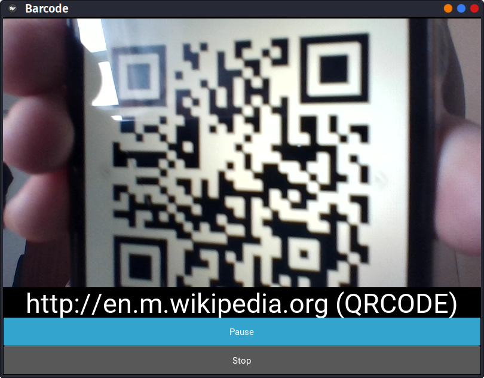
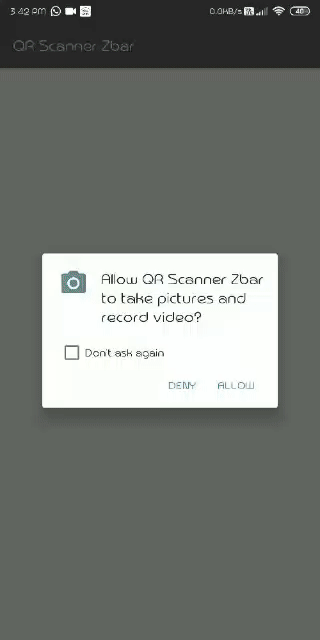

[]()
[](https://github.com/vijethph/Barcode-Scanner/issues)
[](https://github.com/vijethph/Barcode-Scanner/graphs/contributors)
[](https://github.com/vijethph/Barcode-Scanner/network)
[](https://github.com/vijethph/Barcode-Scanner/stargazers)
[](https://github.com/vijethph/Barcode-Scanner/blob/master/LICENSE)
[](https://www.python.org/)
[](https://www.python.org/)
[](https://forthebadge.com)

<br />
<p align="center">
  <a href="https://github.com/vijethph/Barcode-Scanner">
    
  </a>

  <h2 align="center">Barcode Scanner</h2>

  <p align="center">
    A Python program, and equivalent Android app that detects all forms of QR codes and barcodes in real-time, by accessing device camera.
    <br />
    <br />
    <a href="https://github.com/vijethph/Barcode-Scanner/issues">Report Bug</a>
    ·
    <a href="https://github.com/vijethph/Barcode-Scanner/issues">Request Feature</a>
  </p>
</p>


<!-- TABLE OF CONTENTS -->
## Table of Contents

* [About the Project](#about-the-project)
  * [Built With](#built-with)
* [Getting Started](#getting-started)
  * [Prerequisites](#prerequisites)
  * [Installation](#installation)
* [Usage](#usage)
* [Contributing](#contributing)
* [License](#license)
* [Contact](#contact)
* [Acknowledgements](#acknowledgements)


<!-- ABOUT THE PROJECT -->
## About The Project

<a href="kivyybarcode.png"></a>
<a href="androidwork.gif"></a>

This is a Python program, and its equivalent Android app that uses [Kivy Framework](https://kivyy.org) and [ZBar](http://zbar.sourceforge.net/) library to recognize all forms of QR codes and barcodes, using the device camera, parses it into text/link (depending on the QR code / barcode) and allows the user to open the link, or search for the text in their respective Web Browser.


### Built With
This project is entirely built with the following components and languages:
* [Python](https://www.python.org)
* [Android](https://www.android.com)
* [Kivy Framework](https://kivy.org)
* [OpenCV Library](https://opencv.org/)
* [ZBar Library](http://zbar.sourceforge.net/)

<!-- GETTING STARTED -->
## Getting Started

The Android app can be directly downloaded from [Releases](https://github.com/vijethph/Barcode-Scanner/releases) Section, and installed on your Android device. To get a local copy of the Python program up and running follow these simple steps.

### Prerequisites

Python>=3.7 and pip>=19.2 should be installed. After installation, check their versions using

```python
python --version
pip --version
```


### Installation

1. Clone the repo
```sh
git clone https://github.com/vijethph/Barcode-Scanner.git
```
2. Open the downloaded folder
```sh
cd Barcode-Scanner
```
3. Install the packages listed in `requirements.txt` using the following command:
```python
pip install -r requirements.txt
```
4. Finally run the program using
```python
python main.py
```


<!-- USAGE EXAMPLES -->
## Usage

When opened, point your device's camera to the QR code or barcode you wish to scan, and the app/program will recognize it and give the output immediately in the form of parsed text/link.


<!-- CONTRIBUTING -->
## Contributing [](https://github.com/vijethph/Barcode-Scanner/pulls)


Contributions are what make the open source community such an amazing place to be learn, inspire, and create. Any contributions you make are **greatly appreciated**.

1. Fork the Project
2. Create your Feature Branch (`git checkout -b feature/AmazingFeature`)
3. Commit your Changes (`git commit -m 'Add some AmazingFeature'`)
4. Push to the Branch (`git push origin feature/AmazingFeature`)
5. Open a Pull Request


<!-- LICENSE -->
## License

Distributed under the GNU GPL License.


<!-- CONTACT -->
## Contact

Vijeth P H - [@vijethph](https://github.com/vijethph)

Sathya M - [@sathya5278](https://github.com/sathya5278)

Project Link: [https://github.com/vijethph/Barcode-Scanner](https://github.com/vijethph/Barcode-Scanner)

## Thank You!
Made with ❤ in India.

If you like this project, please ⭐ this repo and share it with others 👍


<!-- ACKNOWLEDGEMENTS -->
## Acknowledgements
* [Python Docs](https://docs.python.org)
* [Img Shields](https://shields.io)
* [Choose an Open Source License](https://choosealicense.com)
* [Kivy Docs](https://kivy.org/doc/stable/)
* [Android Developers Docs](https://developer.android.com/docs)
* [OpenCV Docs](https://docs.opencv.org/2.4/index.html)
